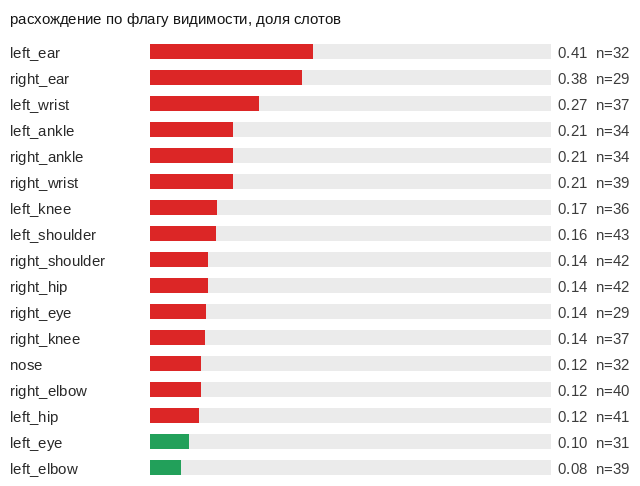
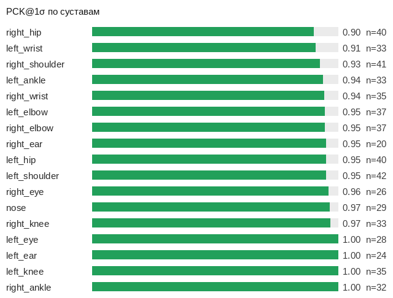
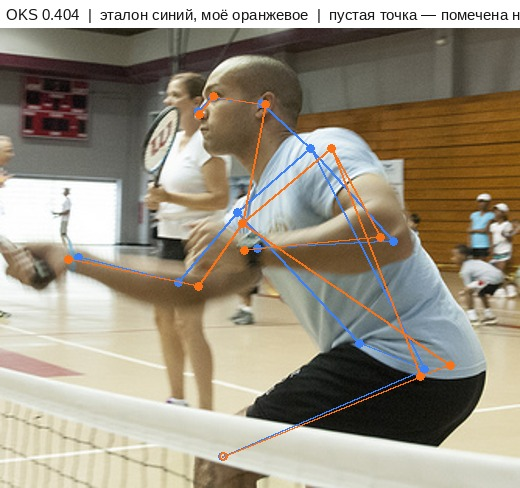
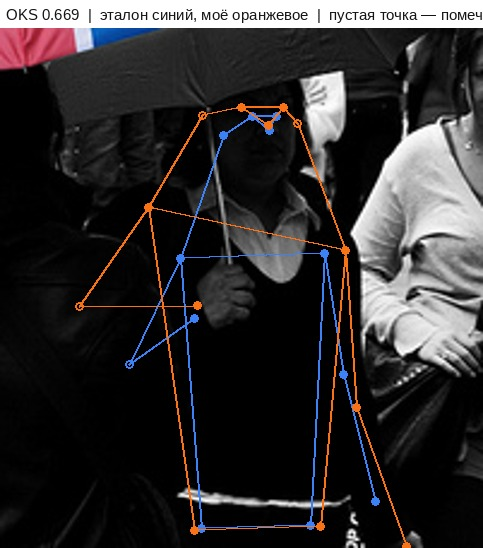
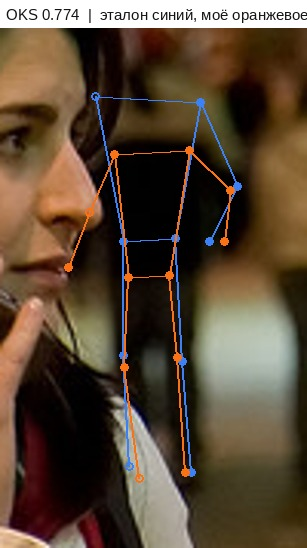
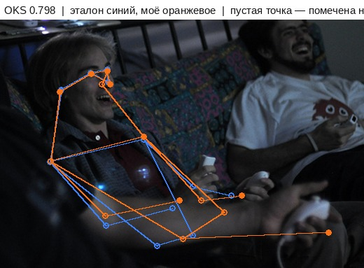
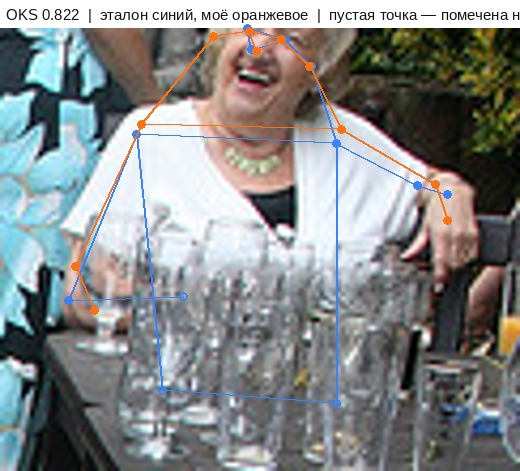
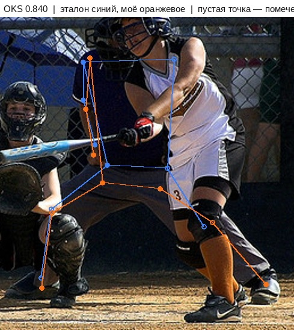
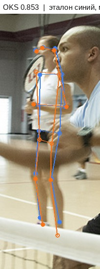
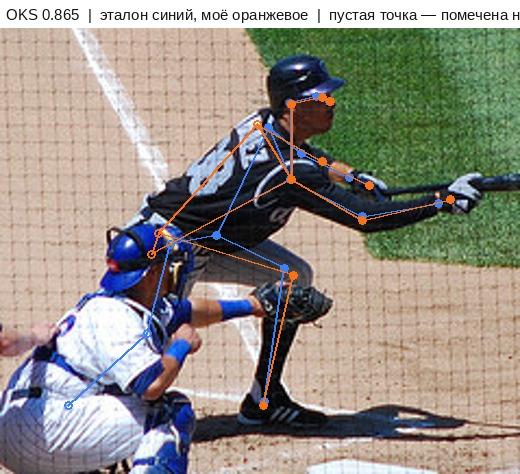

# keypoint-annotation

Согласованность разметки скелетов: 17 точек COCO на человека.
14 кадров val2017 размечены вручную вслепую от эталона.
Считаются три разные вещи: точность координат (OKS), точность
по каждому суставу отдельно (PCK) и согласие по флагу видимости —
последнее не видно ни одной метрике по координатам.
Этап A4 портфолио по контролю качества разметки.

<!-- note:intro -->
> **Что здесь произошло:** _заполнить_
<!-- /note -->

## Результат

| | |
|---|---|
| кадров | 14 |
| людей своих / эталонных | 47 / 47 |
| сопоставлено пар | 43 |
| **OKS по общим точкам** | **0.895** |
| OKS COCO-style | 0.868 |
| PCK@1σ | 0.954 |
| **согласие по флагу видимости** | **0.822** |
| каппа Коэна по флагу | 0.345 |

Сопоставление людей — по рамке из размеченных точек, порог IoU 0.3: ось независима от метрики, иначе человек
с перепутанными сторонами не находит пары и худший случай просто
исчезает из отчёта.

Без пары: эталонных 4, своих 4 (из них 2 — человек, которого отбросил фильтр эталона, 2 — не соответствует эталону ни в чём).

## Что метрика по координатам не видит

Флаг видимости у точки — отдельная ось разметки, и OKS её не
затрагивает вовсе: разметка с идеальными координатами, где каждая
точка помечена видимой, даёт OKS ровно 1.000. Поэтому согласие по
флагу считается отдельно, а рядом стоит каппа: доля совпадений
высока сама по себе, если один из флагов встречается чаще прочих.

| эталон \ моё | v=0 не размечена | v=1 не видна | v=2 видна |
|---|---|---|---|
| v=0 не размечена | 0 | 23 | 13 |
| v=1 не видна | 8 | 25 | 19 |
| v=2 видна | 8 | 39 | 482 |

## Где промахивается рука

Допуск PCK — одна сигма COCO для этого сустава на этом масштабе,
то есть вклад точки в OKS не ниже exp(-1/2) = 0.607. Порог назван
заранее и под результат не подбирался.

| худшие суставы | PCK | точек | средний промах, px |
|---|---|---|---|
| right_hip | 0.90 | 40 | 13.6 |
| left_wrist | 0.91 | 33 | 11.1 |
| right_shoulder | 0.93 | 41 | 7.9 |
| left_ankle | 0.94 | 33 | 9.9 |
| right_wrist | 0.94 | 35 | 12.3 |

| размер человека | пар | OKS |
|---|---|---|
| мелкие | 11 | 0.895 |
| средние | 22 | 0.902 |
| крупные | 10 | 0.879 |

## Разбор худших пар

Синий — эталон, оранжевый — моё. Точка закрашена, если помечена
видимой, и пустая, если помечена невидимой.

### 000000551820.jpg · эталон #1247453

OKS 0.404

<!-- note:000000551820_1247453 -->
> **Что здесь произошло:** _заполнить_
<!-- /note -->

### 000000233771.jpg · эталон #220854

OKS 0.669

<!-- note:000000233771_220854 -->
> **Что здесь произошло:** _заполнить_
<!-- /note -->

### 000000100624.jpg · эталон #500399

OKS 0.774

<!-- note:000000100624_500399 -->
> **Что здесь произошло:** _заполнить_
<!-- /note -->

### 000000023899.jpg · эталон #448028

OKS 0.798

<!-- note:000000023899_448028 -->
> **Что здесь произошло:** _заполнить_
<!-- /note -->

### 000000080340.jpg · эталон #542289

OKS 0.822

<!-- note:000000080340_542289 -->
> **Что здесь произошло:** _заполнить_
<!-- /note -->

### 000000132544.jpg · эталон #1676854

OKS 0.840

<!-- note:000000132544_1676854 -->
> **Что здесь произошло:** _заполнить_
<!-- /note -->

### 000000551820.jpg · эталон #1248862

OKS 0.853

<!-- note:000000551820_1248862 -->
> **Что здесь произошло:** _заполнить_
<!-- /note -->

### 000000474078.jpg · эталон #1729803

OKS 0.865

<!-- note:000000474078_1729803 -->
> **Что здесь произошло:** _заполнить_
<!-- /note -->

## Что дальше

- Инструкция и решения по спорным случаям — [annotation/GUIDELINES.md](annotation/GUIDELINES.md)
- Полный отчёт — [reports/keypoint_report.md](reports/keypoint_report.md)
- Долг по написанному не мной коду — [DEBT.md](DEBT.md)

README пересобирается `tools/build_readme.py`; комментарии между маркерами
`<!-- note:… -->` и `<!-- /note -->` при пересборке сохраняются.
